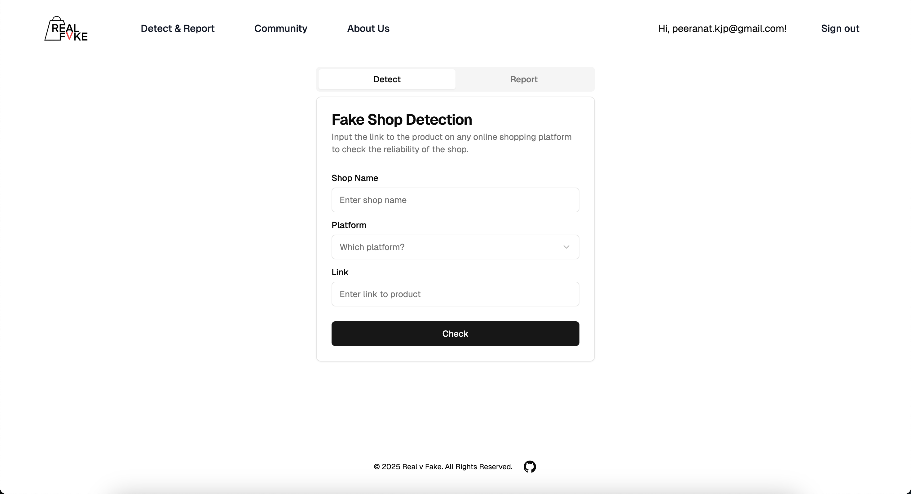

<h1 align="center">SCDS TechFest Hackathon 2025 - Team 9: Real v Fake</h1>

<p align="center">
  <a href="https://nextjs.org"></a>
  <a href="https://react.dev/"></a>
  <a href="https://www.typescriptlang.org/"></a>
  <a href="https://tailwindcss.com/"></a>
  <a href="https://ui.shadcn.com/"></a>
</p>
<p align="center">
  <a href="https://supabase.com"></a>
  <a href="https://fastapi.tiangolo.com/"></a>
  <a href="https://platform.openai.com/"></a>
  <a href="https://huggingface.co/"></a>
  <a href="https://www.python.org/"></a>
</p>

## Key Features

- **Authenthication:** users can register and login via email
- **Fake Shop/Product Detection:**
  - Product Review Sentimental Analysis: [Xenova/bert-base-multilingual-uncased-sentiment](https://huggingface.co/Xenova/bert-base-multilingual-uncased-sentiment)
  - Review Tone Analysis: [Xenova/distilbert-base-uncased-finetuned-sst-2-english](https://huggingface.co/Xenova/distilbert-base-uncased-finetuned-sst-2-english)
  - AI-Generated Detection: [openai-community/roberta-base-openai-detector](https://huggingface.co/openai-community/roberta-base-openai-detector)
  - Classification Model with ChatGPT Feature Engineering


- **Community Database:** users can report fake shops, which will be added to our database shown to all users


## Demo

You can view a fully working demo at [demo-nextjs-with-supabase.vercel.app](https://demo-nextjs-with-supabase.vercel.app/).

## Visit Us

To try Real v Fake, visit our website: [https://realvfake.vercel.app](https://realvfake.vercel.app/).
> Due to privacy policies, our website can only be applied to Amazon website

> The sentimental analysis model may face Vercel server runtimes limit, so the results may not fully display

## Clone and run locally

1. You'll first need a Supabase project which can be made [via the Supabase dashboard](https://database.new)

2. Add environment variables in `.env.local`
   ```
   NEXT_PUBLIC_SUPABASE_URL=[INSERT SUPABASE PROJECT URL]
   NEXT_PUBLIC_SUPABASE_ANON_KEY=[INSERT SUPABASE PROJECT API ANON KEY]
   NEXT_PUBLIC_OPENAI_API_KEY=[INSERT OPENAI API KEY]
   ```
3. Clone this repository

   ```bash
    git clone https://github.com/Saltykub/Real-v-Fake.git
   
    cd real-v-fake
    pnpm i
    pnpm dev
   ```


## Developers

From Nanyang Technological University, Singapore:
1. Peeranat Kongkijpipat
2. Plengpin Tongdon-ngao
3. Kulpatch Chananam
4. Nathan Juirnarongrit
